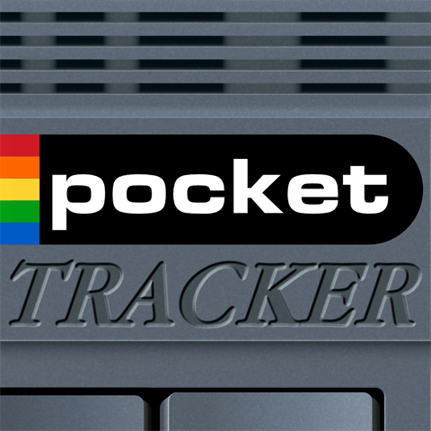
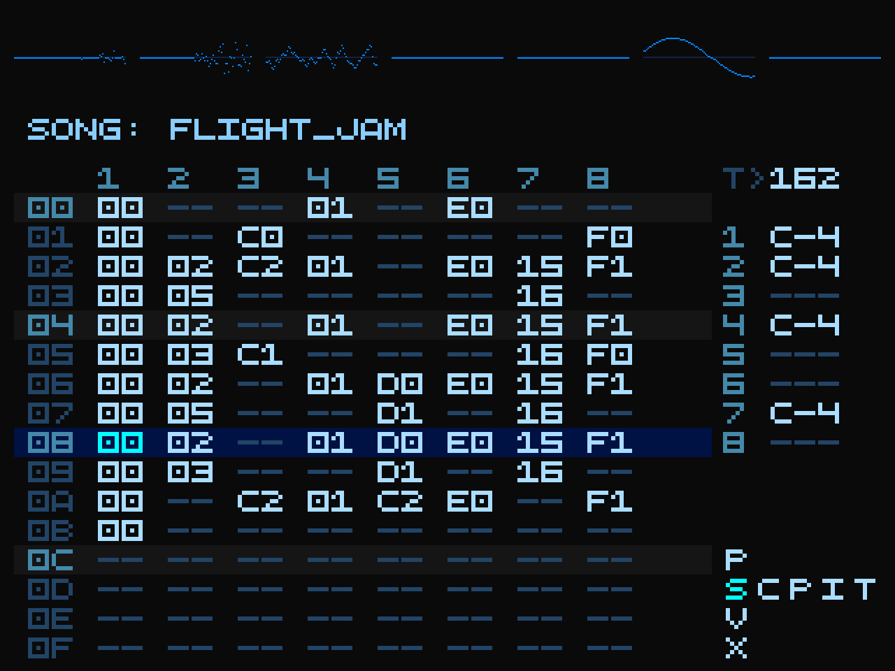

# PocketTracker

<p align="center">
  
  &nbsp;&nbsp;
  
</p>

PocketTracker is a music tracker for Android-based devices — a phone, or a retro gaming handheld will work. It carries on the spirit of trackers like LSDJ and LGPT. It's free, open-source, and runs on hardware you've probably already got — the goal is to put a capable music-making tool in anyone's pocket.

> **Note:** This project was developed with AI assistance. If that bothers you, this project isn't for you.

**Status:** 0.9.0 — first public release (pre-1.0)
**License:** [GPL-3.0-or-later](LICENSE)

---

## Features

### Instruments
Two instrument types: a **sampler** that loads WAV, MP3, M4A, FLAC, OGG and Opus files, and a **SoundFont** player for SF2 files.

### Sampling from video
Just screen record stuff from YouTube or your favourite video games and sample it with the built-in video-to-WAV converter!

### Sample editor
Edit samples on the device: trim, fade, normalise, reverse and more. Add effects, repitch, STRETCH (can't wait to hear your jungle tunes), slice (as one-shots, or just add slice markers to your sample).

### Controls
PocketTracker is made for gaming handhelds with physical buttons. For phones and other touchscreen devices, there's an on-screen control layout.

### Effects
Audio effects are also there! Overdrive, bitcrusher, filters, EQs, reverb and delay (as send channels), and a master bus with OTT (aggressive soundgoodizer) or DUST (a special blend from Skoomabwoy to squish your tracks and make them more lofi-ish). All of them can be applied to your samples in the sample editor!

### Tracks, mixing & export
Arrange a song across eight stereo tracks and balance it on a mixer with per-track sends and true dBFS meters. Export the finished mix as a WAV, or export each track as a separate stem.

### Resampling
Record whatever the sequencer is playing into a new sample — for layering drums, freezing a chord into a pad, or flattening a section to build on.

### Appearance
Recolour the interface with the theme editor and save palettes. The top bar has six visualizer modes. The phone portrait layout also comes with an Amiga-style skin.

➡️ Full feature list: [`docs/features.md`](docs/features.md)

---

## Supported devices

Almost any Android gaming handheld or phone.

**Minimum requirements:** Android 8.0 (API 26) · 64-bit (arm64-v8a / x86_64) · ~512 MB RAM · ~50 MB storage · 640×480 screen

Tested on the **Miyoo Flip** (1 GB RAM, GammaOSCore Android 13), **Ayaneo Pocket Air Mini** (3 GB RAM, Android 11) and **Xiaomi 12T Pro** (8 GB RAM, LineageOS Android 16).

---

## Installation

### APK (recommended for most people)

An APK will be posted to [Releases](https://github.com/conanizer/pockettracker/releases) at public release.

### Build from source

**Requirements:** Android Studio (Hedgehog+), Android NDK 25.1+, CMake 3.22.1+

```bash
git clone https://github.com/conanizer/pockettracker.git
cd pockettracker
./gradlew assembleDebug          # build
./gradlew installDebug           # build + install to a connected device
```

Output APK: `app/build/outputs/apk/debug/`

---

## Documentation

| Document | Contents |
|---|---|
| [`docs/manual-en.md`](docs/manual-en.md) | Full user manual |
| [`docs/input-system.md`](docs/input-system.md) | Complete controls reference |
| [`docs/features.md`](docs/features.md) | Feature overview |
| [`docs/technical-architecture.md`](docs/technical-architecture.md) | Architecture overview |

---

## Contributing

Not yet accepting external code contributions — PocketTracker is approaching its first public release. After release:

- Bug reports → GitHub Issues
- Feature requests / questions → GitHub Discussions
- Code, docs, and example projects welcome

---

## Credits

PocketTracker is built on excellent open-source work — Oboe, DaisySP, TinySoundFont, KissFFT, dr_libs, libopus, and more, plus the [skoomaDust](https://github.com/skoomabwoy/skoomaDust) lo-fi chain by [@skoomabwoy](https://github.com/skoomabwoy). Inspired by **M8**, **LGPT**, and **LSDJ**.

Full attributions, licenses, and DSP algorithm references: [`CREDITS.md`](CREDITS.md).

---

## License

PocketTracker is free software: you can redistribute it and/or modify it under the terms of the **GNU General Public License v3.0 or later** as published by the Free Software Foundation.

It is distributed in the hope that it will be useful, but **without any warranty** — without even the implied warranty of merchantability or fitness for a particular purpose. See the [GNU General Public License](https://www.gnu.org/licenses/gpl-3.0.html) for details.

Full license text: [`LICENSE`](LICENSE).
